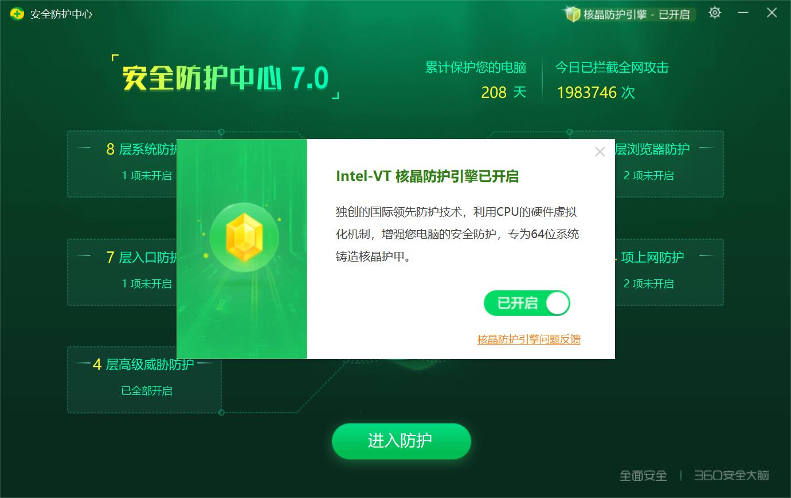
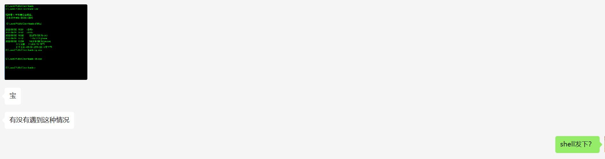
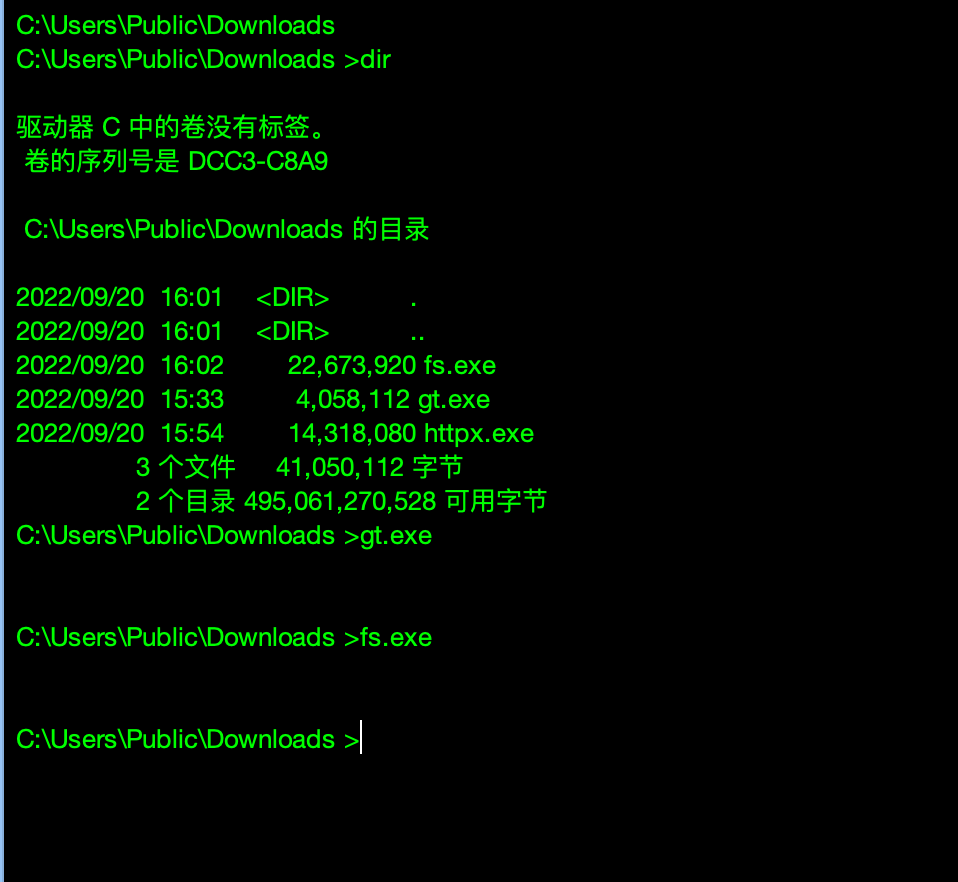
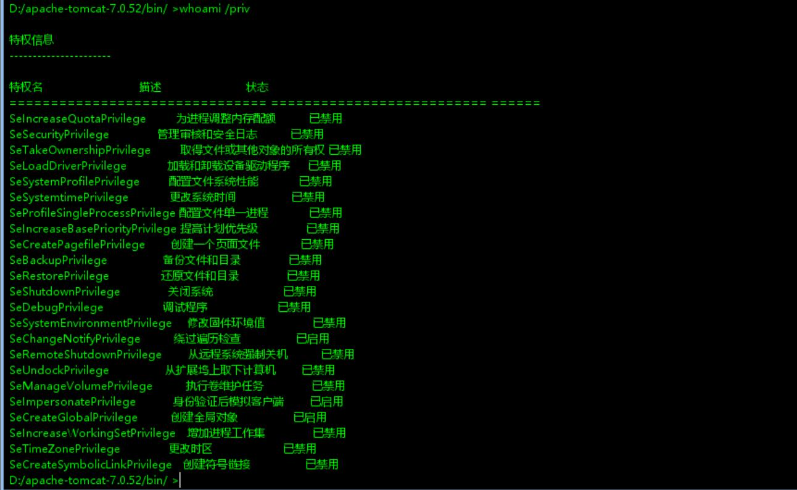
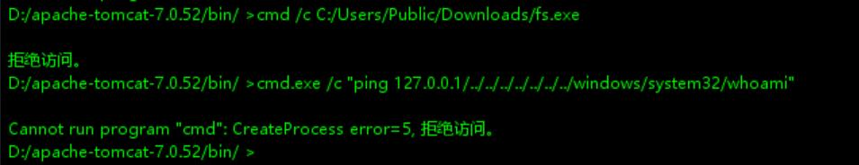
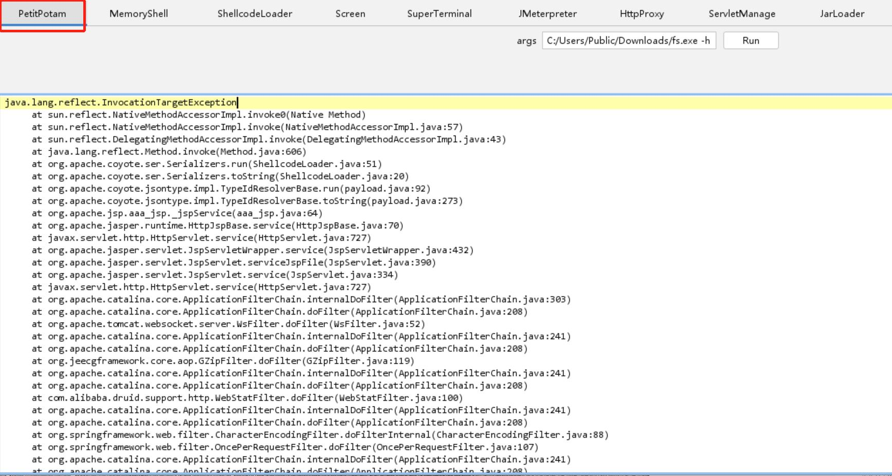
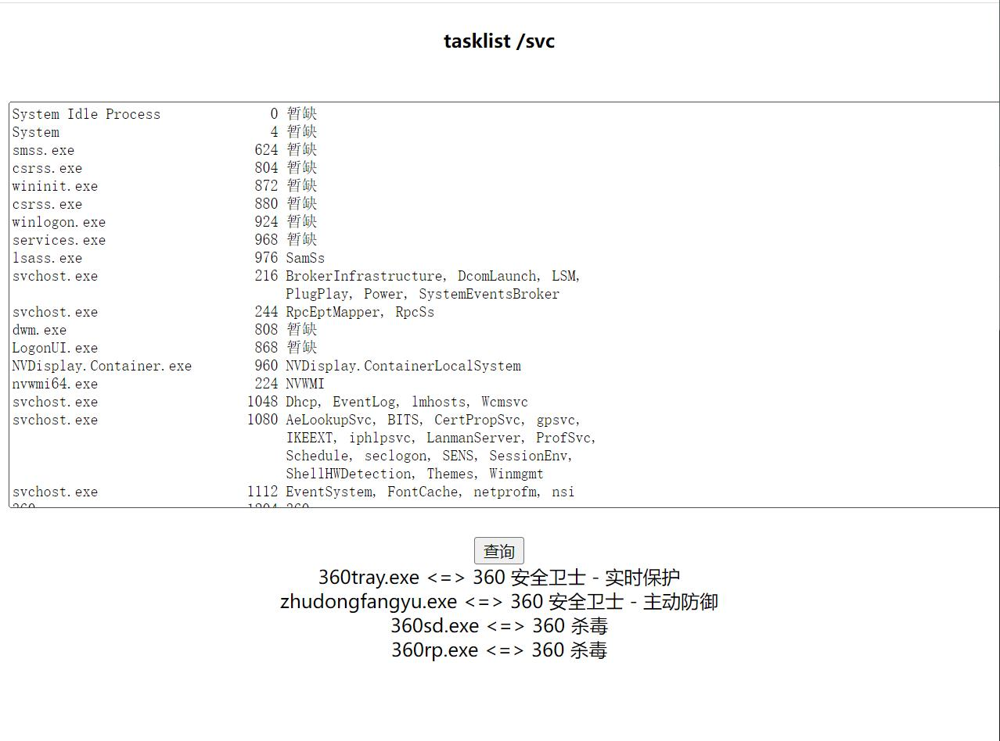

# 002-场景技巧篇-另类bypass 360的方法

## 0x00 前言

360在国内的普及度和知名度确实牛逼，连我老家村口情报组里的嗲嗲奶奶们都知道有这么个玩意，所以咱们安服仔和它打交道也算是家常便饭了。

author：nigle、黑仔

notes：字数约1700字，阅读时间5-10分钟

## 0x01 免责声明

请您务必认真阅读、充分理解下列条款内容：

1、本公众号分享的任何文章仅面向合法授权的企业安全建设行为与个人学习行为，严禁任何组织或个人用于非法活动。

2、在使用本文相关工具及技术进行测试时，您应确保该行为符合当地的法律法规，并且已经取得了足够的授权。

3、如果您在使用本文相关工具及技术的过程中存在任何非法行为，您需自行承担相应后果，我们将不承担任何法律及连带责任。

4、严禁任何组织或个人使用本公众号的名义进行非法盈利。

5、本公众号的所有分享工具及技术文章，严禁不经过授权的公开分享。

如果发现上述禁止行为，我们将保留追究您法律责任的权利，并由您自身承担由禁止行为造成的任何后果。

## 0x02 问题出现

咚咚，来了一条微信消息。是她，但不是她/(ㄒoㄒ)/~~。

哈哈哈，原来是朋友圈中的最强女黑客找我探讨问题，看了她给的截图，大概猜测是起代理或者运行fscan被360拦截了。

可正常执行whoami，ipconfig等常用命令。

看下当前用户权限，基本上都disabled了。

运行已上传的fscan，`cmd /c xxx.exe`，显示拒绝访问。

`cmd /c "ping 127.0.0.1/../../../../../windows/system32/whoami"`，也显示Cannot run program "cmd": CreateProcess error=5, 拒绝访问。

通过godzilla的模块去执行fs，也被拦了。

至此可确定：无法执行上传的扫描工具、代理工具、shellcode_loader等，但是又能执行常规的命令，简单理解就是无法运行非信任的可执行程序，起进程就拦了。

何方妖孽，敢伤吾宝，还不快快现出原形！

哈哈哈，果然是360。

## 0x03 解决问题

无需忧虑，看我一条命令，轻松搞定。

看到这里的师傅们，估计已经在问候我了：”留图不留种，菊花万人捅“。

呜呜呜，弟弟也不想，只恨这招”老汉推车“不是小弟我原创，等下次征求到原作者同意后，再放出来分享给大家，敬请期待！

希望各位师傅能理解我的苦衷，这玩意就好比0day，知道的人越少，使用的范围越小，就越管用。别人辛辛苦苦研究出来的大宝贝，毫无保留分享给我，所以我也只能在征求其同意后，放出来给大家，嘿嘿嘿，望见谅！

## 0x04 抛砖引玉

分享一个比较好玩的姿势，给大家伙抛砖引玉，以弥补大伙的时间损失，毕竟时间宝贵，真心感谢大家的信任。

360安全大脑想必都不陌生，它拥有海量的病毒特征库，360安全卫士客户端通过连接安全大脑，使360的防御能力大大提升，yyds。

当咱们执行敏感操作时，就经常会被这个逼给黄牌警告，比如：

创建用户，被黄牌警告告警（告警源是安全大脑）

 

同样，添加计划任务也是

稍微细心的师傅，可能也和小弟一样发现了：当咱们经常在内网中漫游时，会碰到一些完全不出网但安装了360的机器，然而它们的防御能力完全弱爆了。简直是掉线了的猫咪附在你身上，纯挂件，哈哈哈！

这里放到本机上来分析，可以看到360tray.exe进程有对外发起tcp连接，推测是跟安全大脑有连接。

重点就在这里：个人推测，如果这些防御功能都基于安全大脑的话，那么安全大脑可能就是把双刃剑，带来更强防御能力的同时或许也会成为这堵高墙下的漏点。

## 0x05 360接我盖伦Q

既然拥有这个防护能力的前提是需要连接安全大脑，为何不从切断连接或者影响连接上入手呢，我直接盖伦给他一个Q，让360陷入沉默，不就OK了。

说到影响本地360客户端连接到安全大脑，这里有个思路：通过防火墙策略组给它进行限制（或许还有其他方法）。

这里做个实验，在没加策略的情况下，执行添加命令的操作，直接给黄牌了。

 

加上策略（影响本地360连接给安全大脑），没有被拦截。

`netsh advfirewall firewall add rule name="gogo3602" dir=out program="C:\Program Files (x86)\360\360Safe\safemon\360tray.exe" action=bypass security=authenticate`

 

再执行敏感操作命令，账户添加成功，芜湖，360安全卫士就此哑火了。

 

当然，像添加计划任务之类的命令，他自然也是挡不住咱们了。

同时，这个方法也是存在一定的局限性的，需要管理员权限才能增加防火墙策略。写出来仅是小弟的一得之见，非常期待各位师傅的良言妙论和改进方案，为推动网络安全建设再加一桶油！

## 0x06 最后的话

文章内容有不合理或者不理解的地方，欢迎评论，咱们共同交流共同进步

文章内容有不合法或者侵权的地方，欢迎指出，核实后将立马删除本文