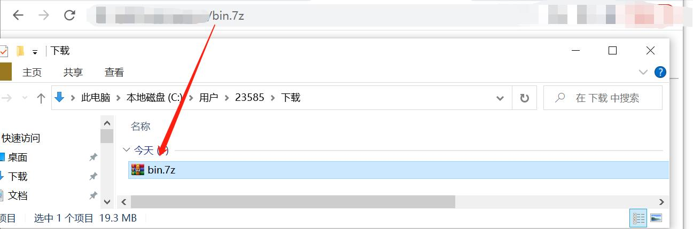

# 003-实战审计篇-从源码泄露到组合拳拿下靶标系统

## 0x00 前言

依稀还记得第一次参加攻防演练时，通过弱口令 + 文件上传之条件竞争拿下了人生第一个权限。那家伙，理论终于变成实践了，激动的我差点直接站起来当场宣布，我是大黑客，哈哈哈...

tips：本文约1900字，阅读时间5-10分钟，祝您阅读愉快🙂

## 0x01 免责声明

请您务必认真阅读、充分理解下列条款内容：

1、本公众号分享的任何文章仅面向合法授权的企业安全建设行为与个人学习行为，严禁任何组织或个人用于非法活动。

2、在使用本文相关工具及技术进行测试时，您应确保该行为符合当地的法律法规，并且已经取得了足够的授权。

3、如果您在使用本文相关工具及技术的过程中存在任何非法行为，您需自行承担相应后果，我们将不承担任何法律及连带责任。

4、严禁任何组织或个人使用本公众号的名义进行非法盈利。

5、本公众号的所有分享工具及技术文章，严禁不经过授权的公开分享。

如果发现上述禁止行为，我们将保留追究您法律责任的权利，并由您自身承担由禁止行为造成的任何后果。

## 0x02 常规套路打一遍

网站是.net的，功能也比较简单，从界面上来看只有登录、注册、忘记密码、安装插件、扫码下载等功能。受赛事得分规则的影响，这里不需要考虑旁站、IP、端口等因素，从其他点打进去的分值不太乐观，直接正面刚靶标给的分数比刷几个内网还来的快。

摸清大概功能后，就是按部就班了，爆弱口令，爆路径，注册账户密码，测注入等等。

dirsearch梭哈一下，没啥东西。

弱口令爆破也够呛，登录失败三次就要验证码，密码字段也被加密了。虽说存在用户名枚举漏洞，但得配合ocr模块来识别验证码，怪麻烦的，可以先继续往下走。

忘记密码和注册功能的容器没有绑定任何事件，也就是说是静态的。

蒜泥狠，咱们从其他静态资源文件里面找找register，forget等关键字，看能否找到接口。发现存在注册，忘记密码倒是真找不到，猜了一些常规的也没猜出来。

注册成功，进入后台，哈哈哈，美滋滋，感觉马上就要拿下了。

我直接宣布，我就是个软柿子┭┮﹏┭┮

进了后台也还是打不动，低权限用户，没啥功能点可以继续挖掘漏洞，也不存在任何注入，要是能拿到源代码就好啦，GG思密达。

## 0x03 漏洞出在牛角尖上

对，要是我有源码就好了，这还不分分钟锤爆它。

这套代码是某某开发商开发的，在官网和代码平台各找了一圈，都不存在源码泄露。到这里，已经有点想打退堂鼓了，要不算了，放弃吧，我不行的，西巴。

哈哈哈，咱们男人，怎么能说不行，说不定服务器上存在开发备份的源码。

根据开发的思维来组装个大概的字典来爆破，看看是否存在备份的源码，规则如下(bin目录是用来针对.net的，有些开发会备份bin目录)：

1、名称：web/bin/域名/开发商域名/系统名/等 + 后缀：.zip/.rar/.tar.gz/.7z/等，如web.zip等。

2、名称：(web/bin/域名/开发商域名/系统名/等 + 字符 + 日期) + 后缀：.zip/.rar/.tar.gz/.7z/等，如web_20220516.zip、web20220516.rar、web-20220516.tar等。

万事俱备后，可以开始跑字典了，看看能否走次狗屎运，嘿嘿。

直接一发入魂，成功下载到了源码，o(*￣▽￣*)ブ

## 0x04 代码审计

拿到代码，话不多说，直接开始找上传，看能否快速拿下。第二个交的成果得要减半，咱们得争分多秒，做一个”秒男“，哈哈哈。

很快，找到了一处上传，从源码可以看出来未对上传文件和路径进行过滤，可任意传和跨目录，但是，怎奈天不佑我，没有返回路径信息，只返回个OK，丢~。

那这样的话，咱们还得想办法得到绝对路径，皇天不负有心人，很奇葩地从一处文件下载的功能点里面，审计到了绝对路径信息泄露，哈哈哈。

光给大伙儿看源码也不好，虽说各位大佬都看得懂，这里还是再啰嗦一下，方便小白们理解，大概讲一下代码的意思。

先是权限校验，然后走到downloadfile2函数，跟进downloadfile2函数，这里并没有对传入的文件名做处理，没有对文件做任何i/o操作，而是直接拼接了传入的参数再转义为字符串后做返回，如下：

## 0x05 组合拳getshell

至此，思路已经很清晰了，组合拳也基本成型：

猜备份文件名 -> 获得源码 -> 代码审计 -> 绝对路径泄露(后台) + 可目录穿越的任意文件上传(后台) -> 找注册接口获取低权限 -> 成功上传getshell

补充一点，可能会有师傅提出：”你这鸟人，糊弄读者，都可目录穿越了，你直接../../../穿越到根目录，不就行了吗？“ 

哈哈哈，答案是，不行。

因为上传后的文件并没有存到web目录下，拿下站后，我也去验证了一下，他这个环境是有两个两个目录的，一个是web，一个是wcf，是wfc的服务来处理的上传请求，上传后的文件也是存在wcf目录下的，所以不知道绝对路径的情况下，是穿越不过去的。

拿权限的这个过程有时候真的很神奇，不光是需要好的运气，还需要足够细节的思维去挖掘漏洞和不言放弃的精神去不断地尝试，如此，才方能修成正果。

## 0x06 最后的话

文章内容有不合理或者不理解的地方，欢迎评论，咱们共同交流共同进步

文章内容有不合法或者侵权的地方，欢迎指出，核实后将立马删除本文