# 007-实战php篇-我为XX种颗树，公司为我安个家

## 一、前言

我为XX种颗树，公司为我安个家。

## 二、开透记录

开透做一次常规的信息收集，运气好一个单引号报错拿捏的死死的。发现是ThinkPHP框架二开写的CMS，以及获取到绝对路径、phpstudy搭建等信息。

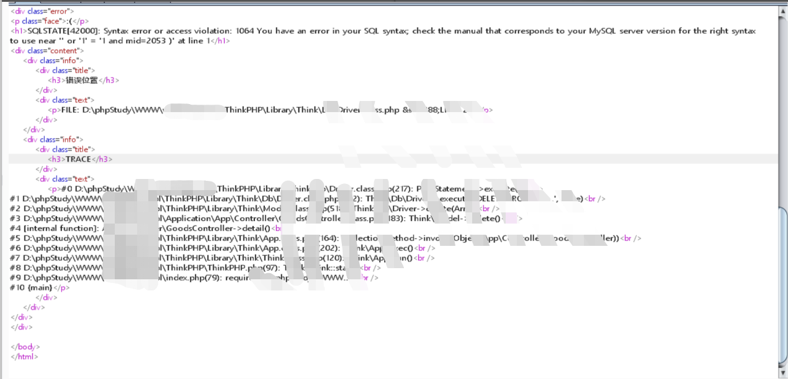

测phpstudy后门不存在，反手一个时间注入Sqlmap一把梭，不用想了弄不出，老老实实写脚本吧。

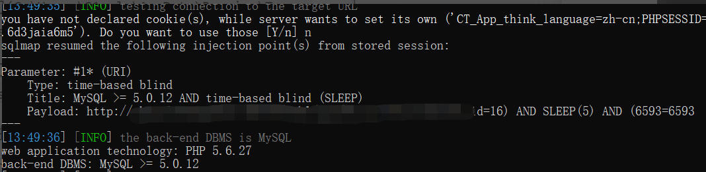

写个脚本，判断当前用户发现非root，且没有写权限

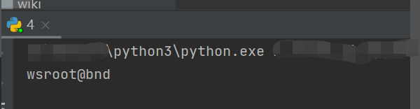

再搞个脚本跑数据库和表，从而跑出后台账号密码

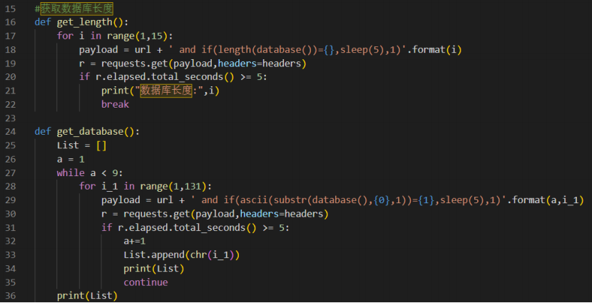

延时注入跑出结果太慢，不想等遂尝试寻找Getshell的方式

由于是TP框架二开而成，开发应该还是会保留runtime log日志，遂尝试寻找日志路径来寻找突破点。

前台日志：/Runtime/Logs/Home/21_12_xx.log

后台日志：/Runtime/Logs/Admin/21_10_xx.log

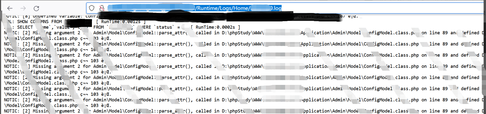

通过对相关日志进行关键词搜索，寻找后台地址及相关账号，如：admin、caiwu、yunwei等，想通过后台尝试弱密码

但访问后台需要令牌才能访问没能绕过GG！

常见漏洞点均测试都未能成功利用，那只能继续信息收集

运气爆棚，在Git中找到了源码而且还是同一套，开发背大锅！

down下源码，通过审计，发现存在远程文件下载漏洞：

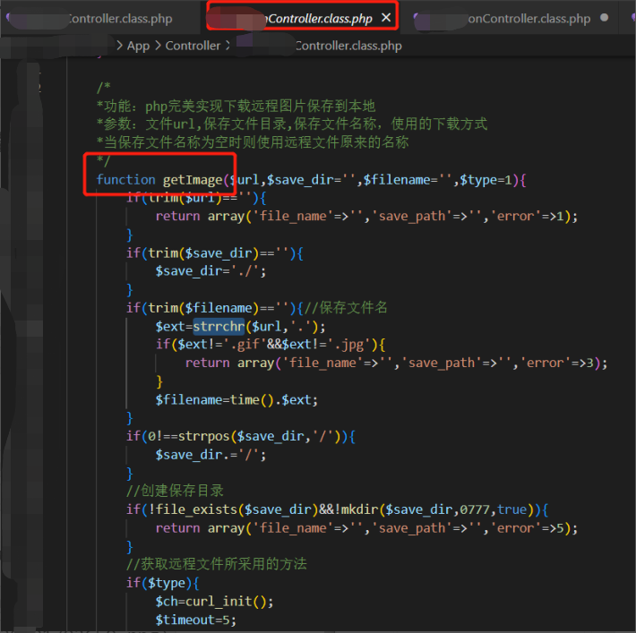

初步验证，漏洞存在

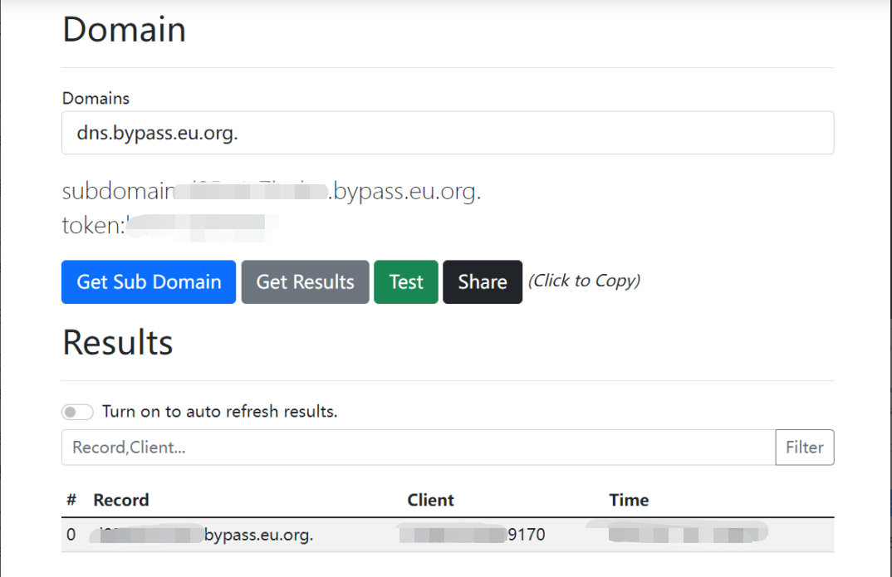

我们需要满足filename不为空，不然则会判断文件后缀。构造payload数据包直接Fuck它。

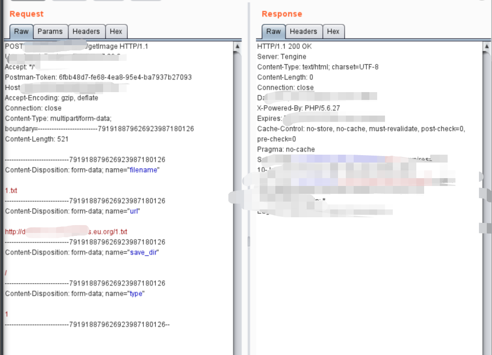

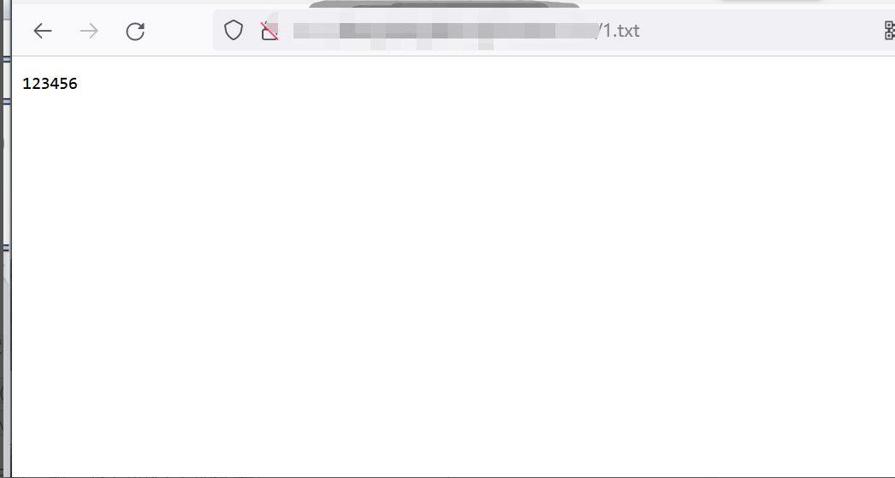

很好，状态码200，很舒服，恋爱的感觉！

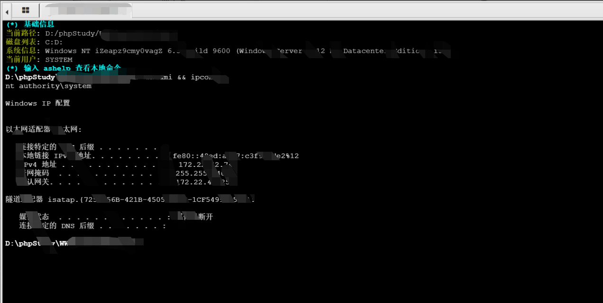

通过翻找配置文件，发现数据库账号密码，仔细一瞅，尼玛进行了加密，丢！

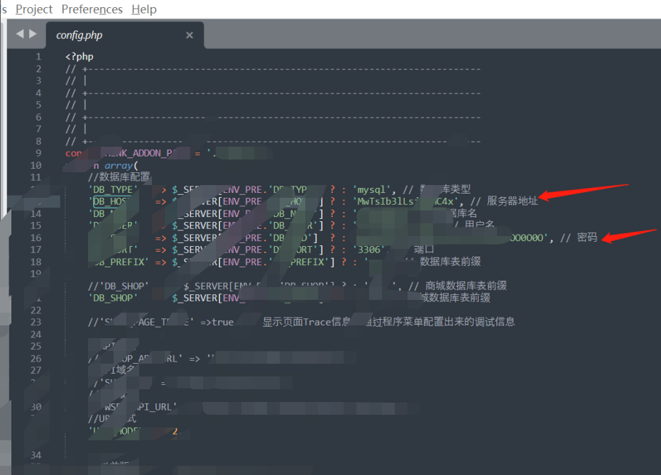

问题不大，开始翻源码，查找相关函数看看是不是开发自己写的加密方式。

真的很喜欢这个开发人员，让我找到初恋的感觉！成功解密出账号，密码。

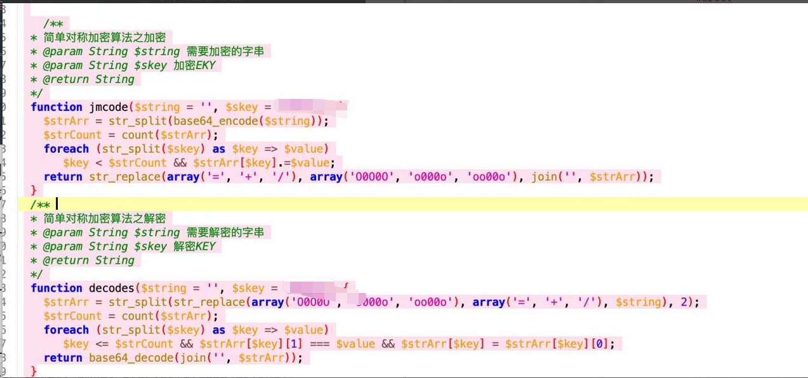

常规的信息收集看了一下进程和端口信息，发现存在云内网，直接搭代理没反应，流量被AliYunDun拦截了，用二开的代理工具就可以绕过。

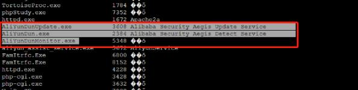

## 三、总结复盘

前期信息收集  -->  发现目标站点为tp框架，存在SQL延时注入、日志泄露等漏洞(拿到绝对路径)  -->  尝试日志缓存写shell，tp历史漏洞，失败  -->  尝试MySQL写文件，跑后台账户密码  -->  攻击后台，存在令牌验证，无法绕过  -->  无果，找源码泄露  -->  发现存在源码，下载并进行审计  -->  审计后发现存在任意文件下载漏洞，且目录名可控(绝对路径)和后缀未被拦截  -->  成功getshell