# 010-实战Java篇-颇为简单的一次审计getshell

## 前言

年少而不可得之人，终会困我一生

本文记录的是：在一次授权渗透测试中从信息收集、源码审计到利用SQL注入、XXE、文件上传最终getshell的过程；加油骚年，没有什么不可得的人或物，牢笼是困不住你的！

## 故事背景

阿SIR，help，有人在搞传销诈骗

大半夜接到任务要透站

作为一个安服仔，没办法，起床，日站

不能整天想妹妹哈哈哈哈~~！

## 信息收集

又是喜闻乐见的信息收集环节，后台是一个登录框，有小程序和商城，目标服务器部署在某讯云，查IP在境外

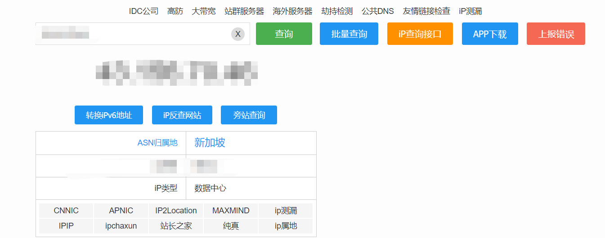

习惯性翻找JS来搜集信息，使用的是国内某个商城系统，xxx admin Java版本

 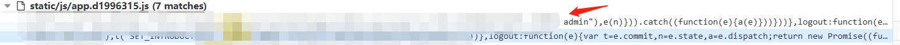

既然找到源码厂商是哪家了，就好办了

准备历史漏洞查询打一波，结果发现这个版本没有公开漏洞

那就只能自己来了，自己动手丰衣足食

## 审计实战

**1、SQL注入漏洞【三枚】：**

入口点controller\XXXXController.java

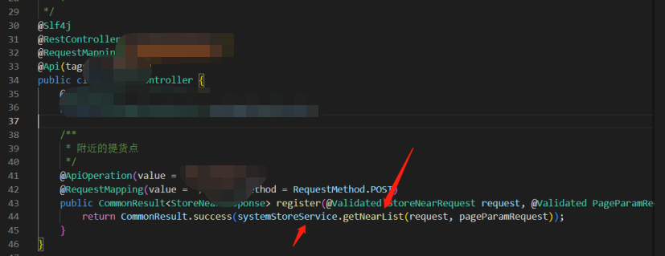

接受POST传参，我们跟进systemStoreService.getNearList，看看具体参数传进去之后怎么去处理的

来到getNearList方法：

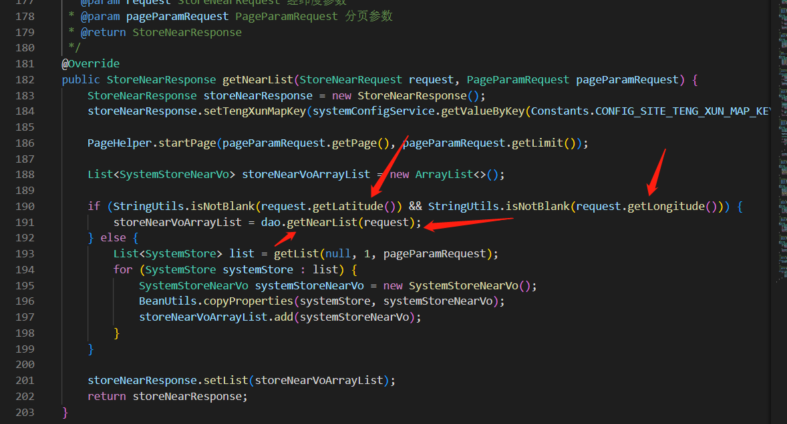

传参获取两个值request.getLatitude及request.getLongitude，并检测字符串是否为空，满足这两个传参不为空，接着走dao.getNearList

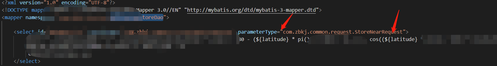

轻松拿捏，利用${}拼接造成注入，看来开发很给面子，反手送我一个注入，笑嘎嘎！

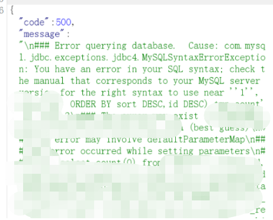

注入出管理的密码加密值，官方存在解密工具，直接利用得到解出后的密码“Admin555222111...”

进入后台，发现文件上传设置修改功能：

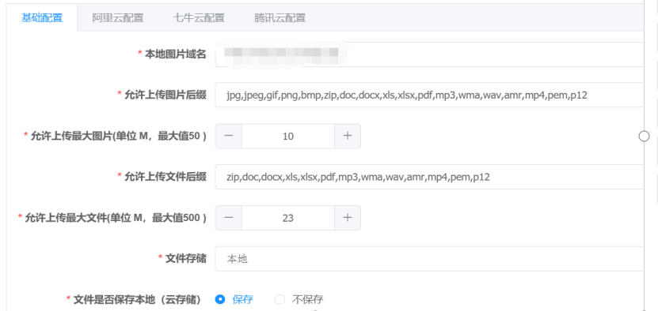

看到这个功能，比爱情来临时的多巴胺分泌还要多，果断尝试getshell，体验安服仔的快乐爱情！

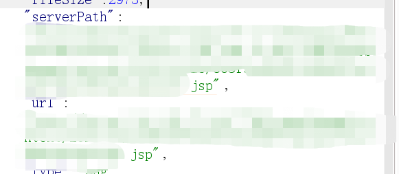

结果发现shell变成下载了，GG，心凉了大半截，呵呵呵呵

一看就是JAR启的服务，瞬间没心态

没办法，为了RMB，还得重新看看代码，寻找属于我的爱情

**2、XML注入**

\XXXXXController.java

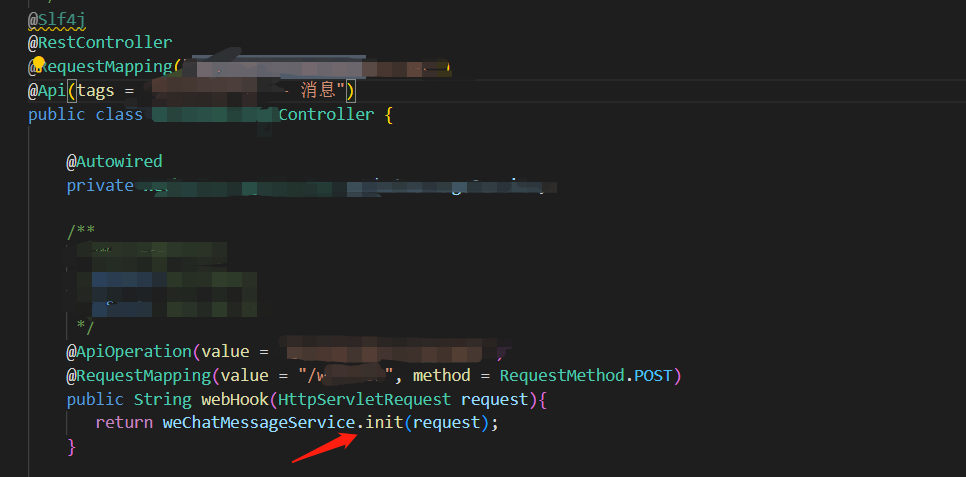

POST接受参数，继续追weChatMessageService.init看看是怎么走的

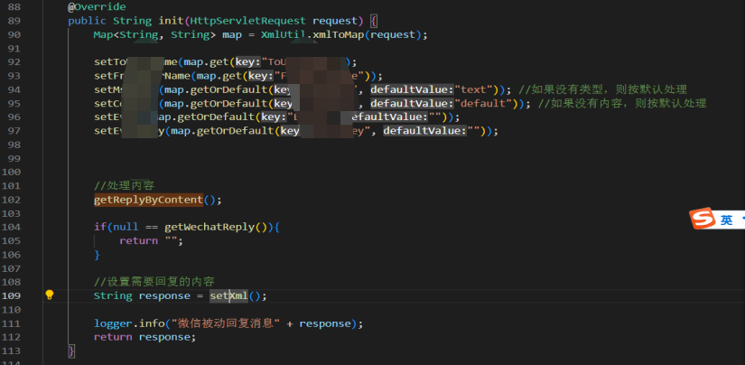

颇为明显的XML注入

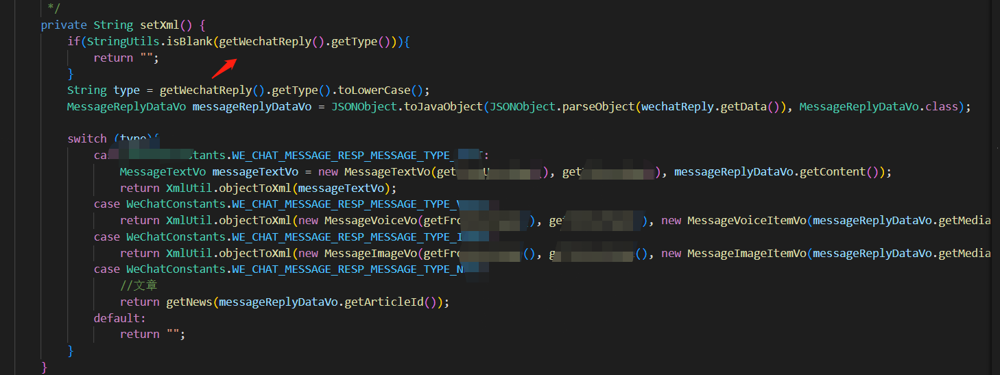

同样手拿把掐，直接构造payload打目标站，发现没有反应

一开始考虑是不是没回显，于是去找官方demo站测试一波

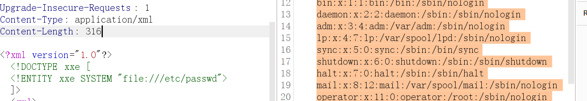

官方demo测试没有问题，能带回显出来

回到目标站继续测试无回显，尝试FTP协议外带出来

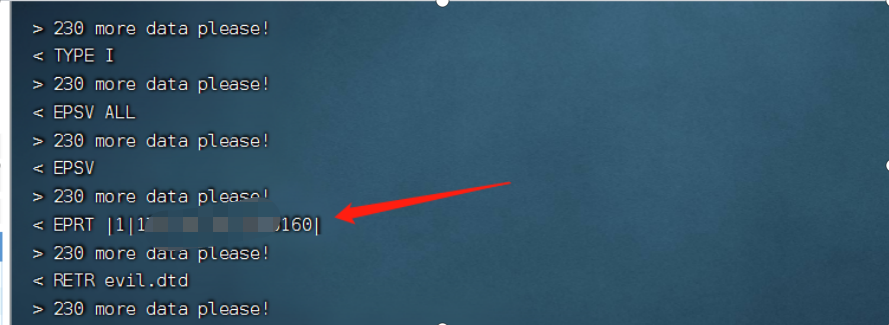

无论怎么更换payload都无法外带出来/etc/passwd

思考了一会儿，同一套源码官方demo可打，目标站不可打

可能是对源码进行了二开或者相关功能模块被关闭了

遂进目标站后台，与官方demo对比发现功能被阉割

但在后台并没有显示，那就抓包手动开启

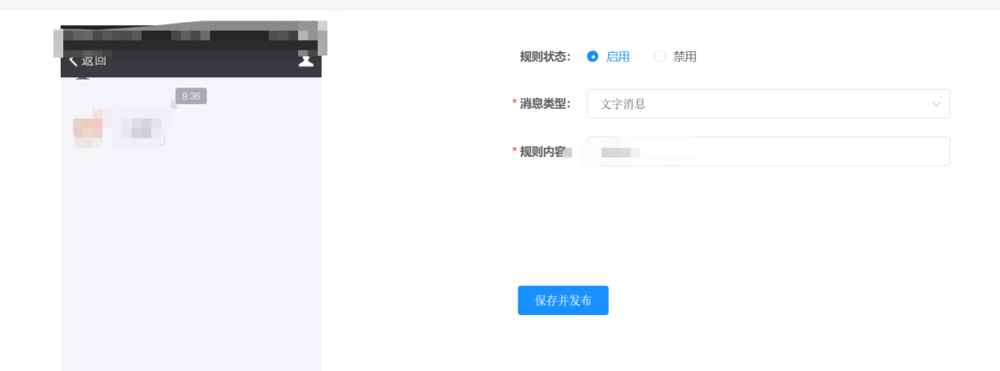

抓包官方demo，并把接口与对应ID值记录下来，替换到目标站中成功发包利用

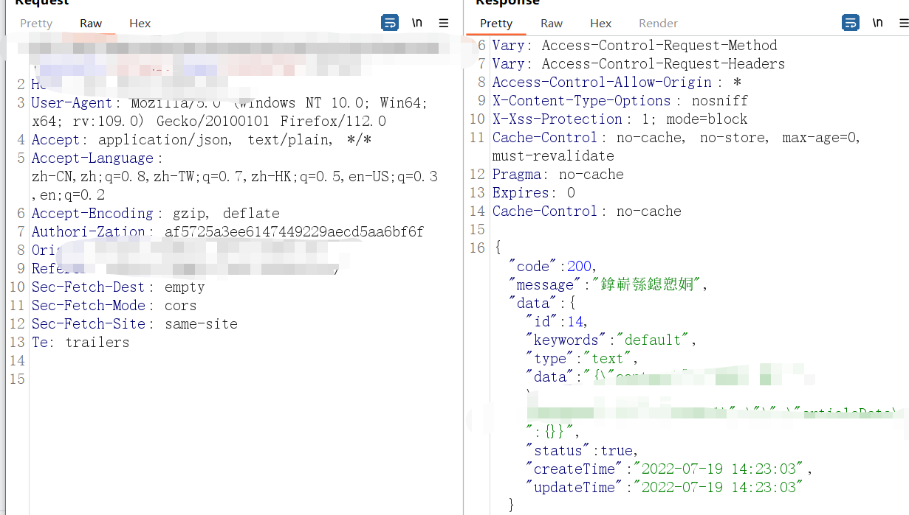

对着目标站直接就一发入魂

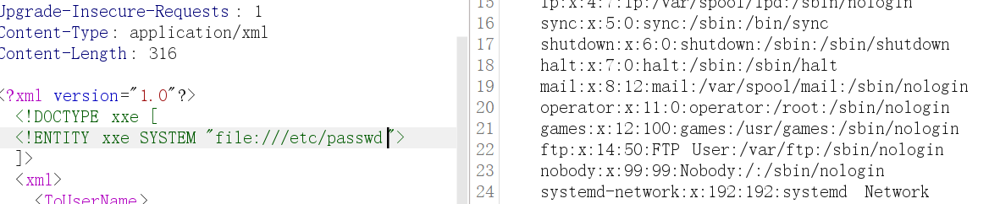

接下来就简单了，读秘钥连服务器连数据库

然而，理想很丰满，现实很骨感，翻了半天没找到秘钥，基本可以进行死亡宣告了

本想休息两天，奈何爱情的力量永远是那么强大！

**3、峰回路转**

再次进行信息收集，思路：原URL是XXX.XXX.XXX.com  换思路继续缩短域名xxx.xxx.com进行信息收集，果然别有洞天

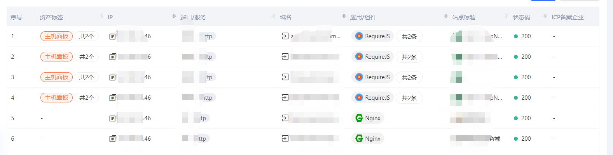

发现了疑似运维的机器，存在一个运维面板以及目标站商城

测试发现，后台账号密码、数据库都是同步的

再次利用XXE漏洞，翻文件做信息收集

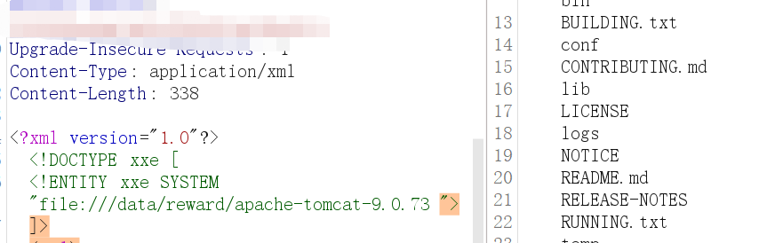

发现tomcat服务，利用刚刚信息收集的ip地址找到对应的服务

一开始是想读shiro秘钥进行getshell，奈何文件太大读不了

于是转变思路，尝试找tomact对应起的web服务，通过目标站后台修改文件上传功能，把文件路径变成tomcatweb路径，最终getshell

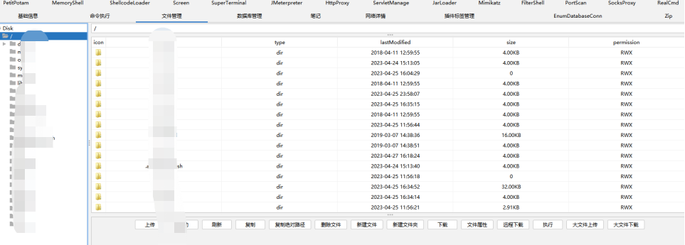

发现存在数据库连接

不可得之人，到手，哈哈哈

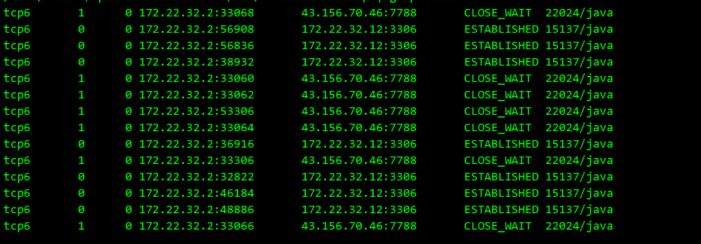

## 文末总结

勿忘初心、合法渗透

坚持学习、保持分享

诸君加油共勉，一切皆为可得！